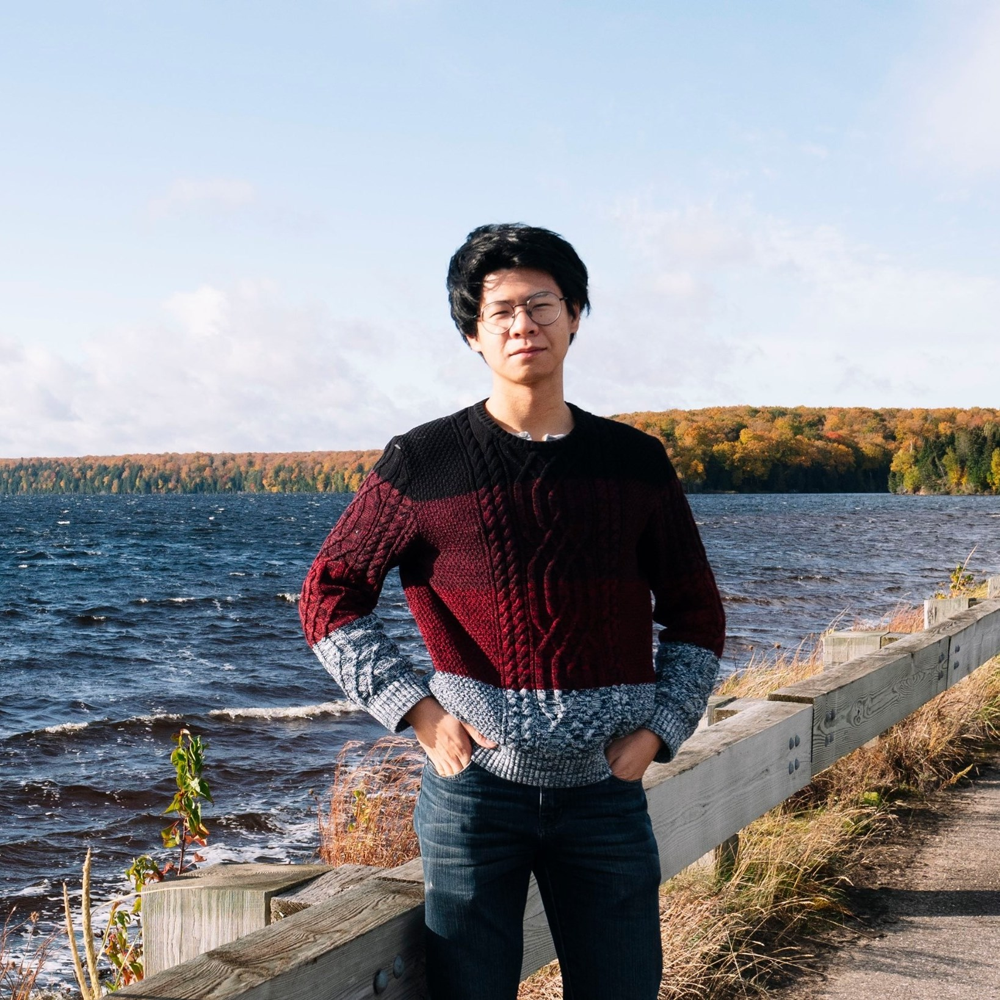

{:.circle.shadow}

### About Me

Hello and welcome to my blog! I’m Yuanpin Zhou, a machine learning engineer based in Hangzhou, Zhejiang, China. I work on AI healthcare projects, applying artificial intelligence and medical imaging techniques to improve diagnosis and treatment. I’m passionate about reading social sciences and literature books, watching movies and TV shows with intriguing plots. I also love photography, especially taking pictures of animals and landscapes.

This blog is where I share my insights and opinions on AI research and applications, programming, and other topics that interest me.

You can learn more about me and my work at [Google Scholar](https://scholar.google.com/citations?user=zCtNbycAAAAJ&hl=en) and [LinkedIn](https://www.linkedin.com/in/yuanpinzhou/). 