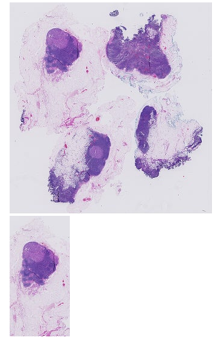
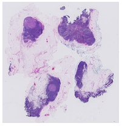

# OpenSlide Python

## Installation

See more details at https://pypi.org/project/openslide-python/

1. [Install OpenSlide](https://openslide.org/download/).
2. `pip install openslide-python`

### Quick installation on Ubuntu

```bash
apt-get install openslide-tools
apt-get install python3-openslide
```

## Tutorial

**OpenSlide**[^1] is a library that provides a simple interface for reading **whole-slide images**, also known as virtual slides, which are *high-resolution* images used in digital pathology. These images can occupy *tens of gigabytes* when uncompressed, and so cannot be easily read using standard tools or libraries, which are designed for images that can be comfortably uncompressed into RAM. Whole-slide images are typically **multi-resolution**; OpenSlide allows reading a small amount of image data at the resolution closest to a desired zoom level. [^2]

### Read a Slide

You can read a slide through the `PIL Image Wrapper` or `OpenSlide Object`. 

`openslide.open_slide(filename)` return an [`OpenSlide`](https://openslide.org/api/python/#openslide.OpenSlide) for whole-slide images and an [`ImageSlide`](https://openslide.org/api/python/#openslide.ImageSlide) for other types of images.

```python
import openslide
slide_path = 'CAMELYON16/testing/images/test_001.tif'
# the bellow methods are equal at reading slide images
wsi = openslide.open_slide(slide_path)  # read through wrapper
wsi = openslide.OpenSlide(slide_path)	# read through object
```

### Slide Properties

Since WSI stores multi-resolution of the slide. You should checkout the information before actually access the image data. As shown in the example,

**`level_count`** refer to the number of levels in the slide.

**`dimensions`** is a `(width, height)` tuple for level 0 of the slide.

**`level_dimensions`** is a list of `(width, height)` tuples, one for each level of the slide. 

**`level_downsamples`** is a list of downsample factors for each level of the slide.

```python
print('''
level_count: {},
dimensions: {},
level_dimensions: {},
level_downsamples: {}
'''.format(wsi.level_count,
           wsi.dimensions,
           wsi.level_dimensions,
           wsi.level_downsamples
          ))
```

```bash
level_count: 9,
dimensions: (86016, 89600),
level_dimensions: ((86016, 89600), (43008, 44800), (21504, 22400), (10752, 11200), (5376, 5600), (2688, 2800), (1344, 1400), (672, 700), (336, 350)),
level_downsamples: (1.0, 2.0, 4.0, 8.0, 16.0, 32.0, 64.0, 128.0, 256.0)
```

**`associated_images`** returns a [`Mapping`](https://docs.python.org/3/library/collections.abc.html#collections.abc.Mapping)  from image name to RGBA [`Image`](https://pillow.readthedocs.io/en/latest/reference/Image.html#PIL.Image.Image), such as label or macro images, which are associated with this slide.

To see the **metadata** about the slide, **`properties`** return a [`Mapping`](https://docs.python.org/3/library/collections.abc.html#collections.abc.Mapping) from OpenSlide property name to property value.

```python
for key, value in wsi.properties.items():
    print(key, value)
```

```bash
openslide.level-count 9
openslide.level[0].downsample 1
openslide.level[0].height 89600
openslide.level[0].tile-height 512
openslide.level[0].tile-width 512
openslide.level[0].width 86016
openslide.level[1].downsample 2
openslide.level[1].height 44800
openslide.level[1].tile-height 512
openslide.level[1].tile-width 512
openslide.level[1].width 43008
openslide.level[2].downsample 4
openslide.level[2].height 22400
openslide.level[2].tile-height 512
openslide.level[2].tile-width 512
openslide.level[2].width 21504
openslide.level[3].downsample 8
openslide.level[3].height 11200
openslide.level[3].tile-height 512
openslide.level[3].tile-width 512
openslide.level[3].width 10752
openslide.level[4].downsample 16
openslide.level[4].height 5600
openslide.level[4].tile-height 512
openslide.level[4].tile-width 512
openslide.level[4].width 5376
openslide.level[5].downsample 32
openslide.level[5].height 2800
openslide.level[5].tile-height 512
openslide.level[5].tile-width 512
openslide.level[5].width 2688
openslide.level[6].downsample 64
openslide.level[6].height 1400
openslide.level[6].tile-height 512
openslide.level[6].tile-width 512
openslide.level[6].width 1344
openslide.level[7].downsample 128
openslide.level[7].height 700
openslide.level[7].tile-height 512
openslide.level[7].tile-width 512
openslide.level[7].width 672
openslide.level[8].downsample 256
openslide.level[8].height 350
openslide.level[8].tile-height 512
openslide.level[8].tile-width 512
openslide.level[8].width 336
openslide.mpp-x 0.22632099999999999
openslide.mpp-y 0.22631600000000002
openslide.quickhash-1 555317bb1cba6865612192006bfba59a3ce967106f73257e7e4d0e8f58803b2c
openslide.vendor philips
philips.DICOM_BITS_ALLOCATED 8
philips.DICOM_BITS_STORED 8
philips.DICOM_DERIVATION_DESCRIPTION tiff-useBigTIFF=1-useRgb=0-levels=10003,10002,10000,10001-processing=0-q80-sourceFilename="T12-02872_1017268 - 2016-01-28 16.23.48.ndpi"
philips.DICOM_HIGH_BIT 7
philips.DICOM_LOSSY_IMAGE_COMPRESSION 01
philips.DICOM_LOSSY_IMAGE_COMPRESSION_METHOD "PHILIPS_TIFF_1_0"
philips.DICOM_LOSSY_IMAGE_COMPRESSION_RATIO "3"
philips.DICOM_MANUFACTURER Hamamatsu
philips.DICOM_PHOTOMETRIC_INTERPRETATION RGB
philips.DICOM_PIXEL_REPRESENTATION 0
philips.DICOM_PIXEL_SPACING "0.000226316" "0.000226321"
philips.DICOM_PLANAR_CONFIGURATION 0
philips.DICOM_SAMPLES_PER_PIXEL 3
philips.DICOM_SOFTWARE_VERSIONS "4.0.3"
philips.PIIM_PIXEL_DATA_REPRESENTATION_SEQUENCE[0].DICOM_PIXEL_SPACING "0.000227273" "0.000227273"
philips.PIIM_PIXEL_DATA_REPRESENTATION_SEQUENCE[0].PIIM_DP_PIXEL_DATA_REPRESENTATION_POSITION "0" "0" "0"
philips.PIIM_PIXEL_DATA_REPRESENTATION_SEQUENCE[0].PIIM_PIXEL_DATA_REPRESENTATION_COLUMNS 86016
philips.PIIM_PIXEL_DATA_REPRESENTATION_SEQUENCE[0].PIIM_PIXEL_DATA_REPRESENTATION_NUMBER 0
philips.PIIM_PIXEL_DATA_REPRESENTATION_SEQUENCE[0].PIIM_PIXEL_DATA_REPRESENTATION_ROWS 89600
philips.PIIM_PIXEL_DATA_REPRESENTATION_SEQUENCE[1].DICOM_PIXEL_SPACING "0.000454545" "0.000454545"
philips.PIIM_PIXEL_DATA_REPRESENTATION_SEQUENCE[1].PIIM_DP_PIXEL_DATA_REPRESENTATION_POSITION "0" "0" "0"
philips.PIIM_PIXEL_DATA_REPRESENTATION_SEQUENCE[1].PIIM_PIXEL_DATA_REPRESENTATION_COLUMNS 43008
philips.PIIM_PIXEL_DATA_REPRESENTATION_SEQUENCE[1].PIIM_PIXEL_DATA_REPRESENTATION_NUMBER 1
philips.PIIM_PIXEL_DATA_REPRESENTATION_SEQUENCE[1].PIIM_PIXEL_DATA_REPRESENTATION_ROWS 45056
philips.PIIM_PIXEL_DATA_REPRESENTATION_SEQUENCE[2].DICOM_PIXEL_SPACING "0.000909091" "0.000909091"
philips.PIIM_PIXEL_DATA_REPRESENTATION_SEQUENCE[2].PIIM_DP_PIXEL_DATA_REPRESENTATION_POSITION "0" "0" "0"
philips.PIIM_PIXEL_DATA_REPRESENTATION_SEQUENCE[2].PIIM_PIXEL_DATA_REPRESENTATION_COLUMNS 21504
philips.PIIM_PIXEL_DATA_REPRESENTATION_SEQUENCE[2].PIIM_PIXEL_DATA_REPRESENTATION_NUMBER 2
philips.PIIM_PIXEL_DATA_REPRESENTATION_SEQUENCE[2].PIIM_PIXEL_DATA_REPRESENTATION_ROWS 22528
philips.PIIM_PIXEL_DATA_REPRESENTATION_SEQUENCE[3].DICOM_PIXEL_SPACING "0.00181818" "0.00181818"
philips.PIIM_PIXEL_DATA_REPRESENTATION_SEQUENCE[3].PIIM_DP_PIXEL_DATA_REPRESENTATION_POSITION "0" "0" "0"
philips.PIIM_PIXEL_DATA_REPRESENTATION_SEQUENCE[3].PIIM_PIXEL_DATA_REPRESENTATION_COLUMNS 10752
philips.PIIM_PIXEL_DATA_REPRESENTATION_SEQUENCE[3].PIIM_PIXEL_DATA_REPRESENTATION_NUMBER 3
philips.PIIM_PIXEL_DATA_REPRESENTATION_SEQUENCE[3].PIIM_PIXEL_DATA_REPRESENTATION_ROWS 11264
philips.PIIM_PIXEL_DATA_REPRESENTATION_SEQUENCE[4].DICOM_PIXEL_SPACING "0.00363636" "0.00363636"
philips.PIIM_PIXEL_DATA_REPRESENTATION_SEQUENCE[4].PIIM_DP_PIXEL_DATA_REPRESENTATION_POSITION "0" "0" "0"
philips.PIIM_PIXEL_DATA_REPRESENTATION_SEQUENCE[4].PIIM_PIXEL_DATA_REPRESENTATION_COLUMNS 5632
philips.PIIM_PIXEL_DATA_REPRESENTATION_SEQUENCE[4].PIIM_PIXEL_DATA_REPRESENTATION_NUMBER 4
philips.PIIM_PIXEL_DATA_REPRESENTATION_SEQUENCE[4].PIIM_PIXEL_DATA_REPRESENTATION_ROWS 5632
philips.PIIM_PIXEL_DATA_REPRESENTATION_SEQUENCE[5].DICOM_PIXEL_SPACING "0.00727273" "0.00727273"
philips.PIIM_PIXEL_DATA_REPRESENTATION_SEQUENCE[5].PIIM_DP_PIXEL_DATA_REPRESENTATION_POSITION "0" "0" "0"
philips.PIIM_PIXEL_DATA_REPRESENTATION_SEQUENCE[5].PIIM_PIXEL_DATA_REPRESENTATION_COLUMNS 3072
philips.PIIM_PIXEL_DATA_REPRESENTATION_SEQUENCE[5].PIIM_PIXEL_DATA_REPRESENTATION_NUMBER 5
philips.PIIM_PIXEL_DATA_REPRESENTATION_SEQUENCE[5].PIIM_PIXEL_DATA_REPRESENTATION_ROWS 3072
philips.PIIM_PIXEL_DATA_REPRESENTATION_SEQUENCE[6].DICOM_PIXEL_SPACING "0.0145455" "0.0145455"
philips.PIIM_PIXEL_DATA_REPRESENTATION_SEQUENCE[6].PIIM_DP_PIXEL_DATA_REPRESENTATION_POSITION "0" "0" "0"
philips.PIIM_PIXEL_DATA_REPRESENTATION_SEQUENCE[6].PIIM_PIXEL_DATA_REPRESENTATION_COLUMNS 1536
philips.PIIM_PIXEL_DATA_REPRESENTATION_SEQUENCE[6].PIIM_PIXEL_DATA_REPRESENTATION_NUMBER 6
philips.PIIM_PIXEL_DATA_REPRESENTATION_SEQUENCE[6].PIIM_PIXEL_DATA_REPRESENTATION_ROWS 1536
philips.PIIM_PIXEL_DATA_REPRESENTATION_SEQUENCE[7].DICOM_PIXEL_SPACING "0.0290909" "0.0290909"
philips.PIIM_PIXEL_DATA_REPRESENTATION_SEQUENCE[7].PIIM_DP_PIXEL_DATA_REPRESENTATION_POSITION "0" "0" "0"
philips.PIIM_PIXEL_DATA_REPRESENTATION_SEQUENCE[7].PIIM_PIXEL_DATA_REPRESENTATION_COLUMNS 1024
philips.PIIM_PIXEL_DATA_REPRESENTATION_SEQUENCE[7].PIIM_PIXEL_DATA_REPRESENTATION_NUMBER 7
philips.PIIM_PIXEL_DATA_REPRESENTATION_SEQUENCE[7].PIIM_PIXEL_DATA_REPRESENTATION_ROWS 1024
philips.PIIM_PIXEL_DATA_REPRESENTATION_SEQUENCE[8].DICOM_PIXEL_SPACING "0.0581818" "0.0581818"
philips.PIIM_PIXEL_DATA_REPRESENTATION_SEQUENCE[8].PIIM_DP_PIXEL_DATA_REPRESENTATION_POSITION "0" "0" "0"
philips.PIIM_PIXEL_DATA_REPRESENTATION_SEQUENCE[8].PIIM_PIXEL_DATA_REPRESENTATION_COLUMNS 512
philips.PIIM_PIXEL_DATA_REPRESENTATION_SEQUENCE[8].PIIM_PIXEL_DATA_REPRESENTATION_NUMBER 8
philips.PIIM_PIXEL_DATA_REPRESENTATION_SEQUENCE[8].PIIM_PIXEL_DATA_REPRESENTATION_ROWS 512
philips.PIM_DP_IMAGE_COLUMNS 86016
philips.PIM_DP_IMAGE_ROWS 89600
philips.PIM_DP_IMAGE_TYPE WSI
philips.PIM_DP_SOURCE_FILE %FILENAME%
philips.PIM_DP_UFS_BARCODE MTAxNzI2OA==
philips.PIM_DP_UFS_INTERFACE_VERSION 3.0
philips.UFS_IMAGE_PIXEL_TRANSFORMATION_METHOD 0
tiff.ResolutionUnit inch
tiff.Software Philips DP v1.0
```

### Access Image Data

Use `read_region(location, level, size)` method to access image data at different resolution.

> `read_region`(*location*, *level*, *size*)
>
> Return an RGBA [`Image`](https://pillow.readthedocs.io/en/latest/reference/Image.html#PIL.Image.Image) containing the contents of the specified region.
>
> Unlike in the C interface, the image data is not premultiplied.
>
> - Parameters
>
>   **location** ([*tuple*](https://docs.python.org/3/library/stdtypes.html#tuple)) – `(col, row)` tuple giving the top left pixel in the *level 0* reference frame
>
>   **level** ([*int*](https://docs.python.org/3/library/functions.html#int)) – the level number
>
>   **size** ([*tuple*](https://docs.python.org/3/library/stdtypes.html#tuple)) – `(width, height)` tuple giving the *region size*

**Notes**

- The order of the tuple to access data is **`(col, row)`** but not `(row, col)` as we did at python.
- `location` is given by **level 0** but not the target level

```python
level = 8
wsi_region = wsi.read_region((0,0),8,wsi.level_dimensions[level])
wsi_region.show()
wsi_region = wsi.read_region((10000,0),8,(100,200))
wsi_region.show()
```

> 

Other WSI methods includes:

> `get_best_level_for_downsample`(*downsample*)[¶](https://openslide.org/api/python/#openslide.OpenSlide.get_best_level_for_downsample)
>
> Return the best level for displaying the given downsample.
>
> - Parameters
>
>   **downsample** ([*float*](https://docs.python.org/3/library/functions.html#float)) – the desired downsample factor

```python
print(wsi.get_best_level_for_downsample(8))
```

```bash
3
```

> `get_thumbnail`(*size*)
>
> Return an [`Image`](https://pillow.readthedocs.io/en/latest/reference/Image.html#PIL.Image.Image) containing an RGB thumbnail of the slide.
>
> - Parameters
>
>   **size** ([*tuple*](https://docs.python.org/3/library/stdtypes.html#tuple)) – the *maximum size* of the thumbnail as a `(width, height)` tuple

**Note**: `get_thumbnail` will NOT change the length-to-width ratio of the original slide.

```python
wsi.get_thumbnail((500,200)).show()
```

> 

> `close`()
>
> ​	Close the OpenSlide object.

**Note**: Once `OpenSlide object` is closed you can't access the object anymore.

```python
wsi.close()
wsi.level_count
```

```bash
---------------------------------------------------------------------------
ArgumentError                             Traceback (most recent call last)
<ipython-input-44-4bfff1759907> in <module>
----> 1 wsi.level_count

/usr/local/lib/python3.6/dist-packages/openslide/__init__.py in level_count(self)
    177     def level_count(self):
    178         """The number of levels in the image."""
--> 179         return lowlevel.get_level_count(self._osr)
    180 
    181     @property

ArgumentError: argument 1: <class 'ValueError'>: Passing closed slide object
```

### Deep Zoom Support

See more detail at the Documentation[^2]

## Resources

[^1]: [OpenSlide Official Site](https://openslide.org/)
[^2 ]: [OpenSlide Python API Documentation](https://openslide.org/api/python/)

[Whole-slide image preprocessing in Python](https://developer.ibm.com/articles/an-automatic-method-to-identify-tissues-from-big-whole-slide-images-pt1/)

